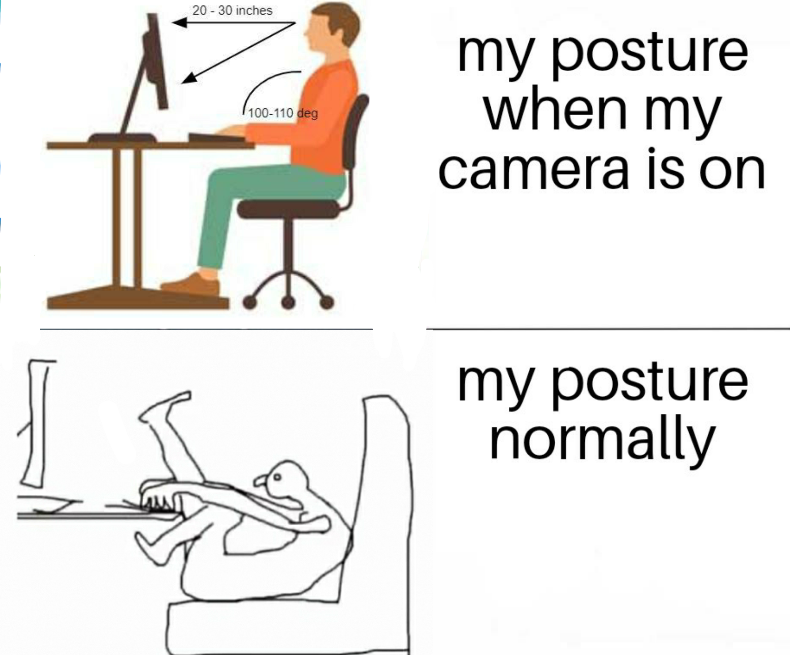

# SIT-UP: An Integrated Posture Detection System

In Rishabh we trust

### Next steps:

- Gather CSV data from real-time data as opposed to doing so asynchronously.
- Log the front facing data as well. We could have one script doing both (front and side-facing measurements), and log this all to the CSV.
- Prepare the user questionnaire for the control group study on Friday.
- Standing desk will be fully operatational (i.e., remote controlled by Sunday).
- Attempt at setting up the coin motor with the Raspberry Pi.
- <i>Trigger:</i> if the camera detects bad posture for over 30 seconds (for example), we could get the seat to vibrate slightly or move the table up.

### Recent accomplishment:

- Got the CSV scripting process to work. All you have to do run the script in `side/side-logging` to see it work. The output video file will be available in the `videos` folder and the CSV will be present in the `logs` folder.

### front-detector.py

- First pass at detecting posture from a front facing camera.

To run: create a models folder in the root of this repo and download the full model from [media pipe](https://ai.google.dev/edge/mediapipe/solutions/vision/pose_landmarker#models).

